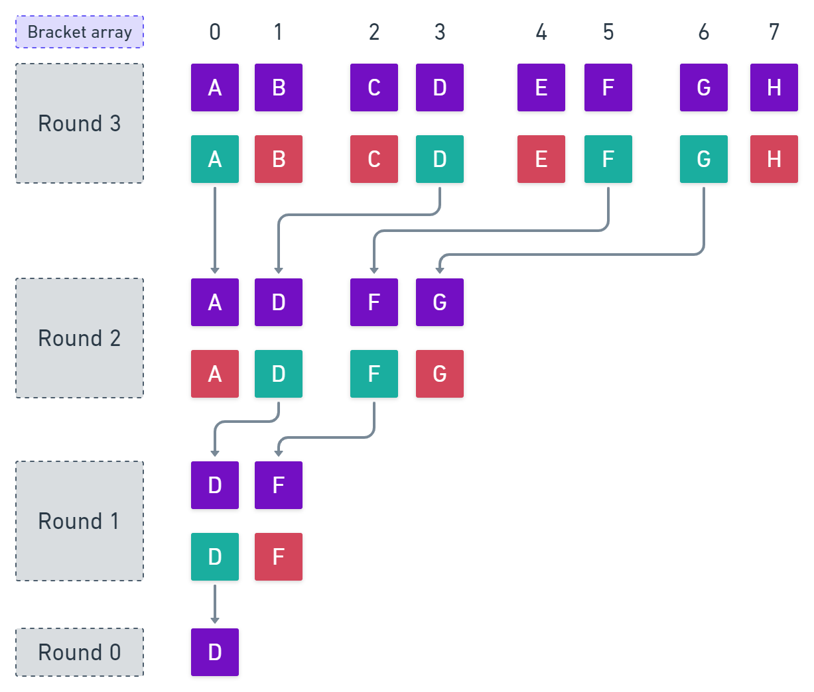

# Gitcoin NFT Tournament

***Warning:** this code has not been audited and may contain bugs and/or vulnerabilities*

To build a fun NFT Tournament that raises money for [Gitcoin Grants](https://gitcoin.co/grants/). The Gitcoin team will solicit eight prominent players in the Ethereum community to provide a dancing gif URL. These gifs will be minted as NFTs and submitted in a bracket tournament where people can vote for the NFTs in 3 rounds. Players vote with crypto, which will all go to the Gitcoin matching pool.

The following bracket represents an NFT tournament with participants from A to H.

<p align="center">
   
</p>

In order to optimize the use of gas, the bracket above is stored in a array respecting the order of matches. In each round, the same array is ​​updated with the winners (in green) of the round, replacing the positions of the first one up to the maximum number of players allowed for that round. Note that the maximum number of players allowed in each round can be defined as *2^n*, where *n* is the round number, that is the reason why we started counting in round 3 instead of round 1.

<p align="center">
   
</p>

## :runner: How to run

Open your terminal in the folder you want to clone the project

```sh
# Clone this repo
git clone https://github.com/upstateinteractive/gitcoin-nft-tournament

# Go to the project folder
cd gitcoin-nft-tournament

# Install dependencies
npm install
```

### :scroll: Scripts

```sh
# Clean and compile
npm run build

# Run and fix linting issues
npm run lint

# Run tests
npm run test

# Run test coverage
npm run coverage
```

## :book: Resources and technologies :computer:

1. Smart Contract

   - [Solidity](https://solidity.readthedocs.io/) - smart contract programming language
   - [Hardhat](https://hardhat.org/) - dApp environment
   - [Open Zeppelin Contracts](https://www.npmjs.com/package/@openzeppelin/contracts) - a library for secure smart contract development

2. Testing

   - [Typescript](https://www.typescriptlang.org/) - superset of JS programming language static typed
   - [Ethers.js](https://docs.ethers.io/) - interact with smart contracts
   - [Chai](https://www.chaijs.com/) - library for tests
   - [Typechain](https://www.npmjs.com/package/@typechain/hardhat) - generate TypeScipt bindings


## :cookie: About

<p align="left">
   
</p>
Brought to you by your friends at <a href="https://upstateinteractive.io/">Upstate Interactive</a>